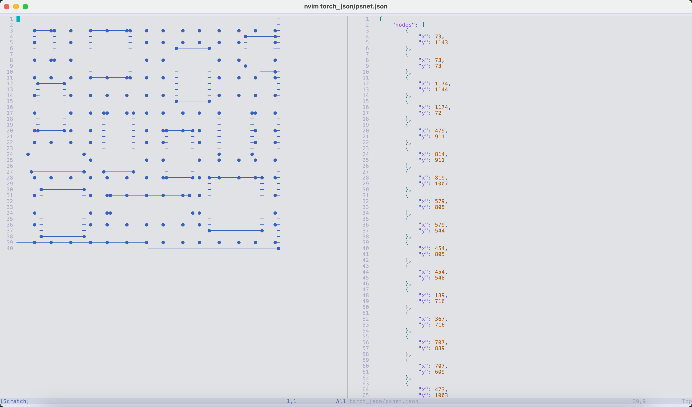

# nodegrapher

A TypeScript/Node.js package for transforming images into spatial graph data. This package provides utilities to extract graph structures from images, making it useful for various applications such as network analysis, path planning, and spatial data processing.

## Installation

```bash
npm install nodegrapher
```

## Features

- Extract graph structures from images
- Generate road-like graph networks
- Optional graph visualization
- TypeScript support
- Flexible output formats

## Usage

### Basic Usage

```typescript
import { processImageToGraph, saveRoad, extractGraphFromImage, visualizeGraph } from 'nodegrapher';

// Process an image and get the full graph data (including obstacles)
const graphData = await processImageToGraph(
  'path/to/image.jpg',
  'output.json',
  1  // maxContainCount: controls the maximum containment count for graph processing
);

// Generate and save a road graph (without obstacles)
const roadGraph = await saveRoad(
  'path/to/image.jpg',  // same input image
  'road.json'          // output path (optional, defaults to "road.json")
);

// To visualize a graph from an image
const graph = await extractGraphFromImage('path/to/image.jpg', 10, 1);
await visualizeGraph('path/to/image.jpg', graph, 'visualization.jpg');
```

### Function Differences

- `processImageToGraph`: Extracts and saves the complete graph structure from an image, including all nodes and obstacles. This is useful when you need the full spatial data representation of the image.

- `saveRoad`: Generates and saves a simplified road graph that focuses on navigable paths while excluding obstacles. This is ideal for applications like path planning where you only need the road network structure.

Both functions process the same input image but produce different outputs based on their specific purposes:
- Full graph (processImageToGraph): Contains all spatial data including obstacles
- Road graph (saveRoad): Contains only the road network structure, optimized for navigation

- `extractGraphFromImage`: Extracts a graph structure directly from an image without saving to file. This is useful when you need to extract the graph structure for further processing or analysis.

- `filterRoadNodes`: Filters out new nodes that are enclosed by any polygons formed by edges_list.


### CLI Usage

The package provides the following CLI commands:

1. Extract graph data from an image:
```bash
npm run extract -- --image_path img/example.jpg --output_path graph.json [--max_contain <number>] [--num_x <number>]
```

2. Extract road graph data from an image:
```bash
npm run extract-road -- --image_path img/example.jpg [--output_path road.json] [--max_contain <number>] [--num_x <number>]
```

3. Visualize graph structure from an image:
```bash
npm run visualize -- --image_path img/example.jpg [--output_path visualization.jpg] [--distance_threshold <number>] [--max_contain <number>] [--num_x <number>]
```

**Extract Command Arguments:**
- `--image_path`: Path to the input image file
- `--output_path`: Path where the output JSON file will be saved
- `--max_contain` (optional): Maximum containment value for graph processing (default: 0)
- `--num_x` (optional): Number of nodes to generate in the x direction for the road graph (default: 15)

**Extract Road Command Arguments:**
- `--image_path`: Path to the input image file
- `--output_path` (optional): Path where the road graph JSON file will be saved (default: road.json)
- `--max_contain` (optional): Maximum containment value for graph processing (default: 0)
- `--num_x` (optional): Number of nodes to generate in the x direction for the road graph (default: 15)

**Visualize Command Arguments:**
- `--image_path`: Path to the input image file
- `--output_path` (optional): Path where the visualization will be saved. If not provided, saves next to input with '_visualized' suffix
- `--distance_threshold` (optional): Distance threshold for node connections (default: 10)
- `--max_contain` (optional): Maximum containment value for graph processing (default: 0)
- `--num_x` (optional): Number of nodes to generate in the x direction for the road graph (default: 15)

### API Reference

#### `processImageToGraph(imagePath: string, outputPath: string, maxContainCount?: number, numX?: number): Promise<GraphData | undefined>`
Processes an image to extract a graph structure and saves it to a JSON file.

- `imagePath`: Path to the input image file
- `outputPath`: Path where the graph data will be saved as JSON
- `maxContainCount` (optional): Maximum containment value for graph processing (default: 0)
- `numX` (optional): Number of nodes to generate in the x direction (default: 15)

Returns a Promise that resolves to the graph data.

#### `saveRoad(imagePath: string, outputPath?: string, maxContainCount?: number, numX?: number): Promise<GraphData | undefined>`
Generates and saves a road graph based on the provided image.

- `imagePath`: Path to the input image file
- `outputPath` (optional): Path where the road graph will be saved as JSON (default: "road.json")
- `maxContainCount` (optional): Maximum containment value for graph processing (default: 0)
- `numX` (optional): Number of nodes to generate in the x direction (default: 15)

Returns a Promise that resolves to the road graph data, or undefined if no road graph could be generated.

#### `extractGraphFromImage(imagePath: string, distanceThreshold?: number, maxContainCount?: number, numX?: number): Promise<GraphData>`
Extracts a graph structure directly from an image without saving to file.

- `imagePath`: Path to the input image file
- `distanceThreshold` (optional): Distance threshold for node connections (default: 10)
- `maxContainCount` (optional): Maximum containment value for graph processing (default: 0)
- `numX` (optional): Number of nodes to generate in the x direction (default: 15)

Returns a Promise that resolves to the graph data.

#### `removeTextFromImage(imagePath: string, outputPath: string): Promise<void>`
Removes text from an image using OpenCV-based text detection.

- `imagePath`: Path to the input image file
- `outputPath`: Path where the processed image will be saved
- Uses adaptive thresholding and contour detection to identify and remove text regions
- Fills removed text areas with the surrounding background color

Returns a Promise that resolves when the text removal is complete.

#### `visualizeGraph(imagePath: string, graph: GraphData, outputPath: string): Promise<void>`
Visualizes a graph structure on top of an image.

- `imagePath`: Path to the input image file
- `graph`: The graph data to visualize
- `outputPath`: Path where the visualization will be saved

Returns a Promise that resolves when the visualization is complete.

### Types

#### `GraphData`
```typescript
interface GraphData {
  nodes: Node[];
  lines: Line[];
  nodesList?: Node[][];
}
```

## Development

To set up the development environment:

1. Clone the repository
2. Install dependencies: `npm install`
3. Run tests: `npm test`
4. Run linter: `npm run lint`

### Neovim Plugin

NodeGrapher also supports converting JSON graph data to ASCII representation using a Neovim plugin. Visit [NodeGrapher.nvim](https://github.com/tkdnbb/node-monorepo/tree/main/packages/nodegrapher.nvim) for more information.

#### Example Usage

Using the `NodeGrapherToAscii` command in Neovim:


Displayed graph window:



## License

MIT License - see LICENSE file for details

## Contributing

Contributions are welcome! Please feel free to submit a Pull Request.