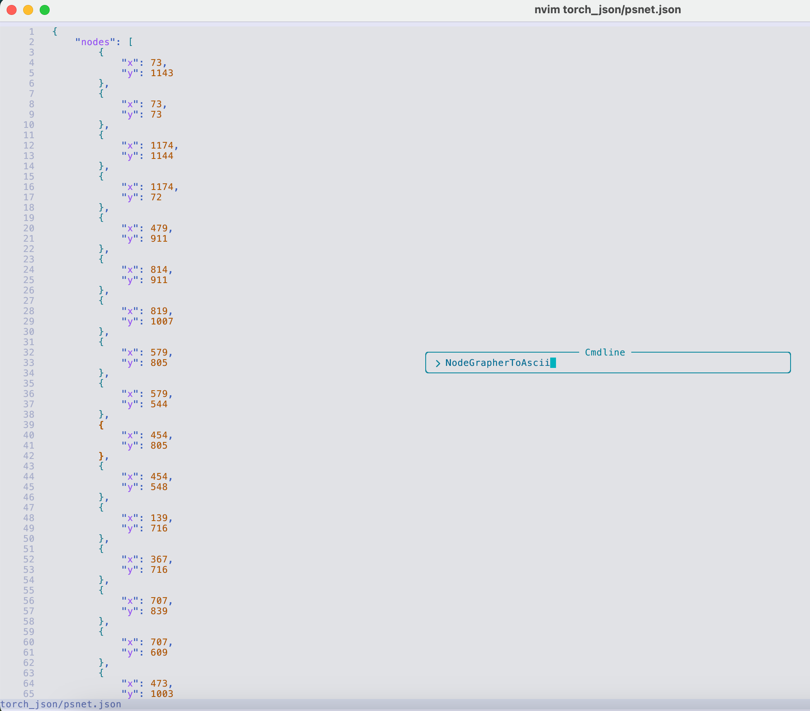
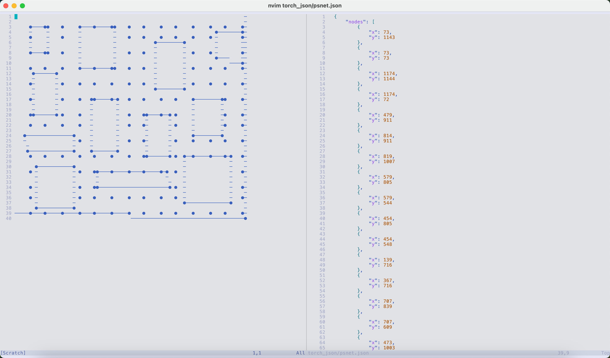

# NodeGrapher

NodeGrapher 是一个 TypeScript/Node.js 包，用于将图像转换为空间图数据。该包提供了从图像中提取图结构的工具，适用于网络分析、路径规划和空间数据处理等应用。

## 安装

```bash
npm install nodegrapher
```

## 功能

- 从图像中提取图结构
- 生成类似道路的图网络
- 可选的图形可视化
- 支持 TypeScript
- 灵活的输出格式

## 使用

### 基本用法

```typescript
import { processImageToGraph, saveRoad, extractGraphFromImage, visualizeGraph } from 'nodegrapher';

// 处理图像并获取完整的图数据（包括障碍物）
const graphData = await processImageToGraph(
  'path/to/image.jpg',
  'output.json',
  1  // maxContainCount: 控制图处理的最大包含计数
);

// 生成并保存道路图（不含障碍物）
const roadGraph = await saveRoad(
  'path/to/image.jpg',  // 相同的输入图像
  'road.json'          // 输出路径（可选，默认为 "road.json"）
);

// 从图像中可视化图形
const graph = await extractGraphFromImage('path/to/image.jpg', 10, 1);
await visualizeGraph('path/to/image.jpg', graph, 'visualization.jpg');
```

### Neovim 插件

NodeGrapher 还支持通过 Neovim 插件将 JSON 图数据转换为 ASCII 字符表示。请访问 [NodeGrapher.nvim](https://github.com/tkdnbb/node-monorepo/tree/main/packages/nodegrapher.nvim) 了解更多信息。

#### 使用示例

在 Neovim 中使用 `NodeGrapherToAscii` 命令：



显示的图形窗口：



## API 参考

#### `processImageToGraph(imagePath: string, outputPath: string, maxContainCount?: number, numX?: number): Promise<GraphData | undefined>`
处理图像以提取图结构并将其保存为 JSON 文件。

- `imagePath`: 输入图像文件的路径
- `outputPath`: 图数据将保存为 JSON 的路径
- `maxContainCount` (可选): 图处理的最大包含值（默认: 0）
- `numX` (可选): 在 x 方向生成的节点数（默认: 15）

返回一个 Promise，解析为图数据。

#### `saveRoad(imagePath: string, outputPath?: string, maxContainCount?: number, numX?: number): Promise<GraphData | undefined>`
根据提供的图像生成并保存道路图。

- `imagePath`: 输入图像文件的路径
- `outputPath` (可选): 道路图将保存为 JSON 的路径（默认: "road.json"）
- `maxContainCount` (可选): 图处理的最大包含值（默认: 0）
- `numX` (可选): 在 x 方向生成的节点数（默认: 15）

返回一个 Promise，解析为道路图数据，或在无法生成道路图时解析为 undefined。

#### `extractGraphFromImage(imagePath: string, distanceThreshold?: number, maxContainCount?: number, numX?: number): Promise<GraphData>`
直接从图像中提取图结构而不保存到文件。

- `imagePath`: 输入图像文件的路径
- `distanceThreshold` (可选): 节点连接的距离阈值（默认: 10）
- `maxContainCount` (可选): 图处理的最大包含值（默认: 0）
- `numX` (可选): 在 x 方向生成的节点数（默认: 15）

返回一个 Promise，解析为图数据。

#### `removeTextFromImage(imagePath: string, outputPath: string): Promise<void>`
使用基于 OpenCV 的文本检测从图像中移除文本。

- `imagePath`: 输入图像文件的路径
- `outputPath`: 处理后的图像将保存的路径
- 使用自适应阈值和轮廓检测来识别和移除文本区域
- 用周围的背景颜色填充移除的文本区域

返回一个 Promise，当文本移除完成时解析。

#### `visualizeGraph(imagePath: string, graph: GraphData, outputPath: string): Promise<void>`
在图像上可视化图结构。

- `imagePath`: 输入图像文件的路径
- `graph`: 要可视化的图数据
- `outputPath`: 可视化结果将保存的路径

返回一个 Promise，当可视化完成时解析。

### 类型

#### `GraphData`
```typescript
interface GraphData {
  nodes: Node[];
  lines: Line[];
  nodesList?: Node[][];
}
```

## 许可证

MIT 许可证 - 详见 LICENSE 文件

## 贡献

欢迎贡献！请随时提交 Pull Request。
