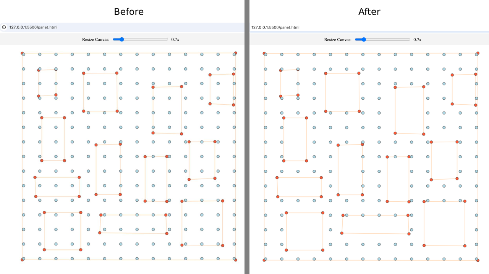

# Steps to Use NodeGrapher

Welcome to NodeGrapher! This guide will help you understand how to use this package to transform images into graph data. We'll also explain some of the cool algorithms it uses in a simple way.

## Step 1: Understanding the Algorithms

### 1. OpenCV and Hough Transform
- **What is it?** OpenCV is a tool that helps computers see and understand images. The Hough Transform is a technique used to find lines in pictures.
- **How does it work?** Imagine drawing lines on a piece of paper. The Hough Transform helps the computer find these lines in an image, even if they are a bit wobbly.

### 2. Line Deduplication
- **What is it?** Sometimes, the computer might find the same line twice or find lines that are almost the same. Line deduplication is like cleaning up these extra lines.
- **How does it work?** It checks if two lines are very close to each other or if they look the same, and then it keeps only one of them.

### 3. Point Merging
- **What is it?** When points are too close to each other, they might be merged into one point.
- **How does it work?** It measures the distance between points and combines them if they are too close, like putting two dots together to make one bigger dot.

## Step 2: Preparing Your Image

Before you start, make sure you have an image that you want to process. This image should be clear and have the features you want to extract, like roads or paths.

## Step 3: Running the Commands

### Visualize the Graph
- **Command:** `npm run visualize -- --image_path <path> [--output_path <path>] [--distance_threshold <number>] [--max_contain <number>] [--num_x <number>]`
- **What it does:** This command takes your image and shows you the graph it creates. You can see how the lines and points connect.

### Remove Text from Image
- **Command:** `npm run remove-text -- --image_path <path> [--output_path <path>]`
- **What it does:** If your image has text that you don't want, this command will try to remove it, leaving just the important parts.

### Extract Road Graph
- **Command:** `npm run extract-road -- --image_path <path> [--output_path <path>] [--max_contain <number>] [--num_x <number>]`
- **What it does:** This command focuses on finding roads in your image and saves the road network as a graph.

### Extract Graph
- **Command:** `npm run extract -- --image_path <path> --output_path <path> [--max_contain <number>] [--num_x <number>]`
- **What it does:** This is the default command to extract a graph from your image and save it to a file.

## Step 4: Check Your Results

After running the commands, check the output files to see the graphs. You can use these graphs for further analysis or visualization.

## Step 5: Troubleshooting

If you encounter any errors, make sure:
- The image path is correct.
- You have the necessary permissions to read/write files.
- OpenCV is properly loaded (the program waits for it to be ready).

## What are the algorithms used in this package?

- [Canny Edge Detection](https://en.wikipedia.org/wiki/Canny_edge_detector)
- [HoughLinesP](https://docs.opencv.org/4.x/d9/db0/tutorial_hough_lines.html)
- [filterRoadNodes](https://github.com/tkdnbb/nodegrapher/blob/main/src/utils/filters.ts#L10)
- [deduplicateLines](https://github.com/tkdnbb/nodegrapher/blob/main/src/utils/filters.ts#L46)
- [mergeClosePoints](https://github.com/tkdnbb/nodegrapher/blob/main/src/utils/pointUtils.ts#L26)
- [genNodes](https://github.com/tkdnbb/nodegrapher/blob/main/src/utils/roadGen.ts#L12)

## Detailed Explanation of `filterRoadNodes`

The `filterRoadNodes` function is essential for refining the graph by removing unnecessary nodes that are enclosed by polygons. This helps in creating a cleaner and more accurate representation of the road network.

### How It Works:
- **Purpose:** It filters out nodes that are inside closed shapes, ensuring only the essential nodes remain.
- **Process:** The function checks each node to see if it is enclosed by any polygons formed by the edges. If a node is inside too many polygons, it gets removed.

### Related Algorithm: `isPointEnclosedByEdges`
- **What it does:** This function determines if a point is inside any closed polygon formed by the graph's edges.
- **Steps:**
  1. **Convert Nodes:** Transform the list of nodes into coordinate pairs.
  2. **Build Adjacency List:** Create a map of connections between nodes based on the edges.
  3. **Find Polygons:** Use Depth-First Search (DFS) to identify unique closed polygons.
  4. **Check Enclosure:** For each polygon, check if the point is inside using geometric calculations.

### Visual Example:
Below is an example of how `filterRoadNodes` improves the graph:



- **Before:** The graph has many nodes, including those inside closed shapes.
- **After:** The unnecessary nodes are removed, leaving a cleaner graph.

That's it! You're now ready to use NodeGrapher to turn images into graph data. Have fun exploring and analyzing your images!

```bash
npm run extract-graph -- --image_path img/psnet.jpg --output_path img/psnet.json
```
